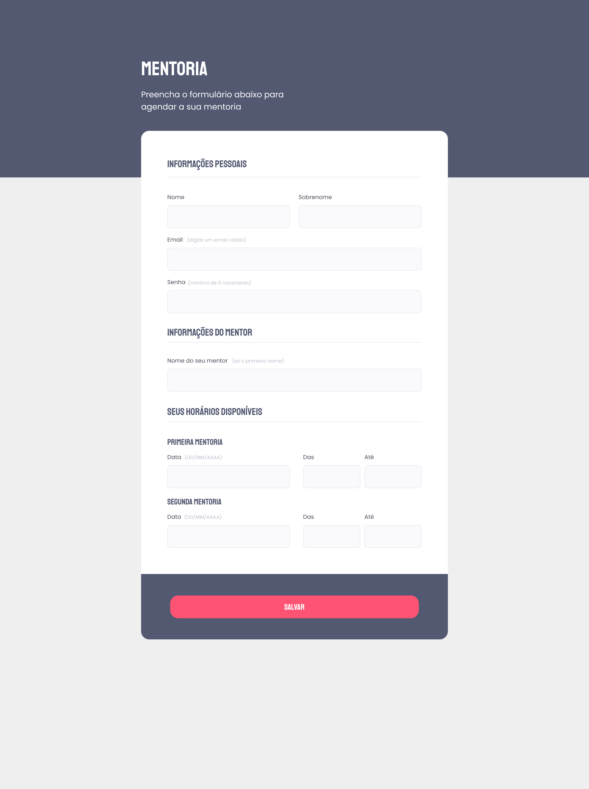

<h1 align="center"> Desafio 03 </h1>

  <a href="#-tecnologias">Tecnologias</a>&nbsp;&nbsp;&nbsp;|&nbsp;&nbsp;&nbsp;
  <a href="#-projeto">Projeto</a>&nbsp;&nbsp;&nbsp;|&nbsp;&nbsp;&nbsp;
  <a href="#-layout">Layout</a>&nbsp;&nbsp;&nbsp;

 

## 🚀 Tecnologias

Esse projeto foi desenvolvido com as seguintes tecnologias:

- HTML e CSS
- Figma

## 💻 Projeto

O intuito desse desafio era replicar um layout proposto pela RocketSeat

Proposta:

  

## ✅ Resultado
- [Acesse o resultado finalizado do Desafio 03, online](https://devbonatto.github.io/Deafio03/)

## 🔖 Layout

Você pode visualizar o layout do projeto através [DESSE LINK](https://www.figma.com/file/kC1ECk4q01OBJzrNcEzC9l/Stage-03-Formul%C3%A1rio-intermedi%C3%A1rio-Copy?fuid=1256335722836990720)
